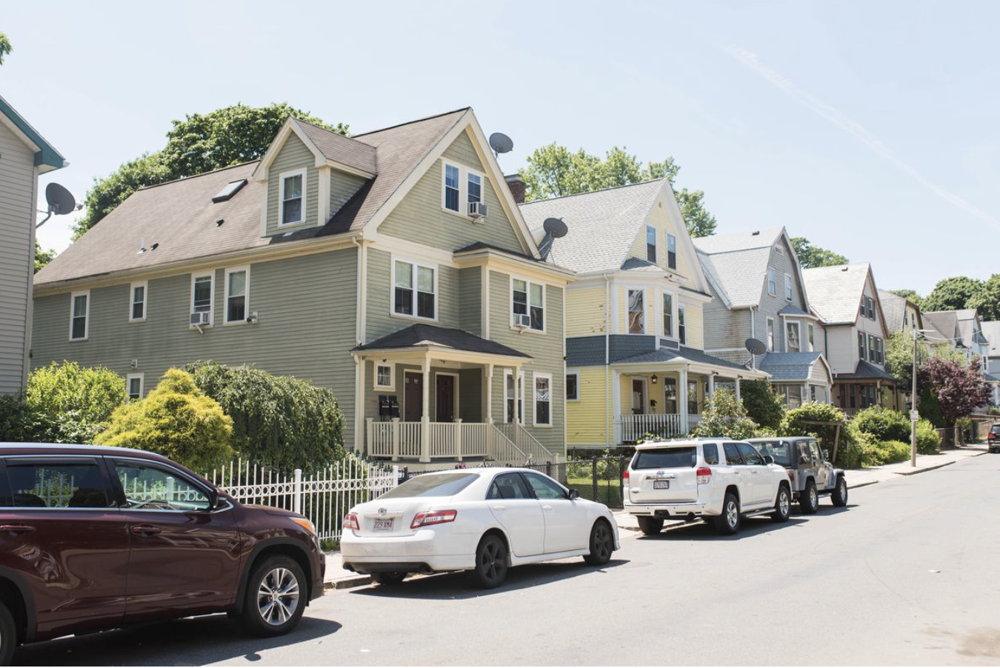

# EC2022-Proyecto Final Housing Prices 





## Colaboradores

| Nombre                     | Clave   |
| -------------------------- | ------- |
| Fabián Orduña Ferreira.    | 159001  |
| José Avilla Nueva López    | 209776  |
| Juan Carlos Soto Hernández | 82616   |


## Dataset

Es un dataset simple se tiene la finalidad de predecir el precio de las casas basadoos en ciertos factores comoo área de la casa, número de baños, si está amueblado, o se encuentra cerca de un camino principal, etc. 

El dataset es pequeño y com'lejo ya que contiene una fuerte multicolinealidad. 

Puedes encontrarlo en la siguiente liga de [KAGGLE](https://www.kaggle.com/datasets/yasserh/housing-prices-dataset)


Número de registros: 545

Número de columnas: 13


* `price`: Variable a predecir, precio de la casa en dólares.

* `area`: Área de la casa

* `bedrooms`: Número de cuartos

* `bathrooms`: Número de baños

* `stories`: Número de pisos de la casa

* `mainroad`: Si está conectada a un camino principal

* `guestroom`: Si tiene cuarto de invitados

* `basement`: Si tienen sótano

* `hotwaterheating`: Si tiene calentador de agua

* `airconditioning`: Si cuenta con aire acondicionado

* `parking`: Número de lugares de estacionamiento
 
* `prefarea`: ¿Está en un área preferente?

* `furnishingstatus`: Es estatus del amueblado

## Herramientas utilizadas:

* Bash

* PostgreSQL

* Docker

* Flask

* Python

* R

* Shiny

# Pregunta a contestar

¿Podemos estimar el precio de las casas con las variables presentadas?

## Pasos para correr este proyecto:

* Clonar el repositorio

```
git clone git@github.com:FabianOrduna/EC2022-Proyecto.git
```

* Cambiar al directorio del proyecto

```
cd EC2022-Proyecto
```


* Construir las imagenes

```
docker-compose build
```

* Activa los contenedores

```
docker-compose up
```

## Colaboradores

| Método   | Endpoint  | Parámetro                   | Cuerpo                          | Resultado                          | 
| -------- | --------- | --------------------------- | ------------------------------- | ---------------------------------- |
| Post     | houses    | NA                          | Price. Variable a predecir <br /> Área. Área de la casa   <br />  Bedrooms. Número de cuartos <br /> Bathrooms. Número de baños <br /> Stories. Número de pisos de la casa  <br />  Mainroad. Si está conectada a un camino principal <br /> Gestroom. Si tiene cuarto de invitados  <br /> Basement. Si tiene zótano <br /> Hotwaterheating. Si tiene calentador de agua <br /> Parking. Número de lugares de estacionamiento <br /> Prefarea. ¿Está en un área preferente? <br /> Furnishingstatus. Es estatus de amueblado | Regresa el objeto creado con su id |
|  GET        |    /houses         |          NA                   | NA          | Regresa lista de casas  |
|  GET        |    /houses/id        |         id: el identificador de la casa a buscar                  | NA          | Regresa una casa  |
| PUT       |    /houses/id        |         id: el identificador de la casa a actualiar                  | Price. Variable a predecir <br /> Área. Área de la casa   <br />  Bedrooms. Número de cuartos <br /> Bathrooms. Número de baños <br /> Stories. Número de pisos de la casa  <br />  Mainroad. Si está conectada a un camino principal <br /> Gestroom. Si tiene cuarto de invitados  <br /> Basement. Si tiene zótano <br /> Hotwaterheating. Si tiene calentador de agua <br /> Parking. Número de lugares de estacionamiento <br /> Prefarea. ¿Está en un área preferente? <br /> Furnishingstatus. Es estatus de amueblado | Regresa el objeto creado con su id         | Regresa el registro actiualizado |
|  DELETE      |  /houses/id          |  id: el identificador de la casa a borrar                  | NA          | Regresa vacio  |

Además, puedes re-emteenar un medelo de predicción de precios con base en los datos que se encuentren en la base.


| Método   | Endpoint  | Parámetro                   | Cuerpo                          | Resultado                          | 
| -------- | --------- | --------------------------- | ------------------------------- | ---------------------------------- |
| POST | /houses/train | NA |Price. Variable a predecir <br /> Área. Área de la casa   <br />  Bedrooms. Número de cuartos <br /> Bathrooms. Número de baños <br /> Stories. Número de pisos de la casa  <br />  Mainroad. Si está conectada a un camino principal <br /> Gestroom. Si tiene cuarto de invitados  <br /> Basement. Si tiene zótano <br /> Hotwaterheating. Si tiene calentador de agua <br /> Parking. Número de lugares de estacionamiento <br /> Prefarea. ¿Está en un área preferente? <br /> Furnishingstatus. Es estatus de amueblado |  Regresa "la operación ha concluido" |


